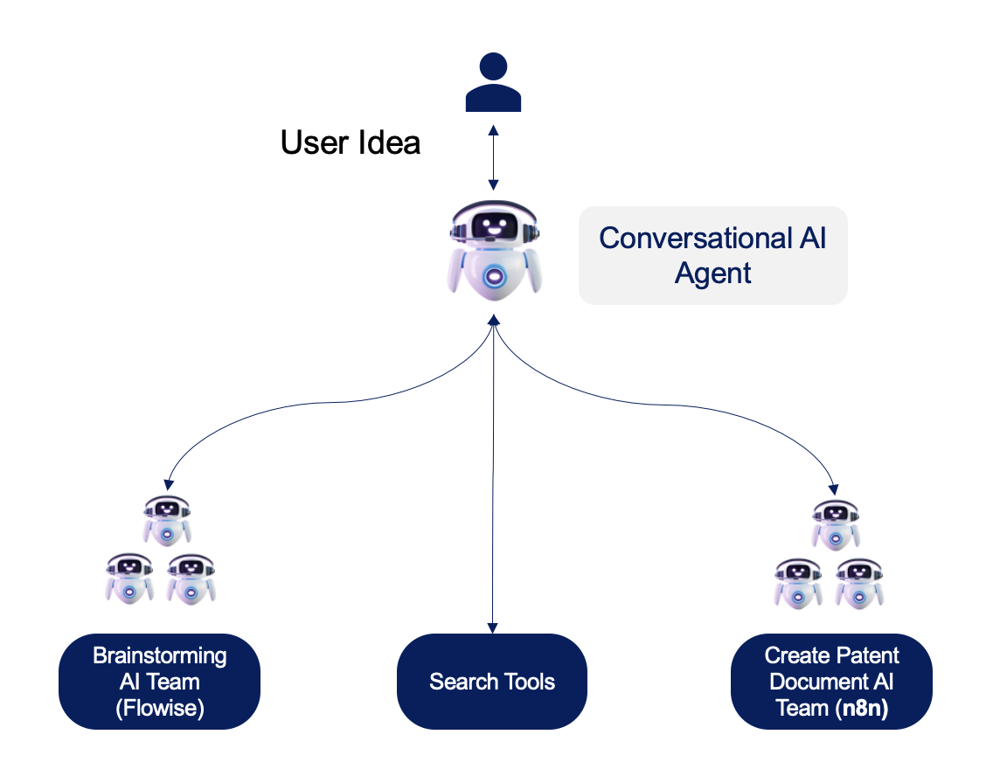
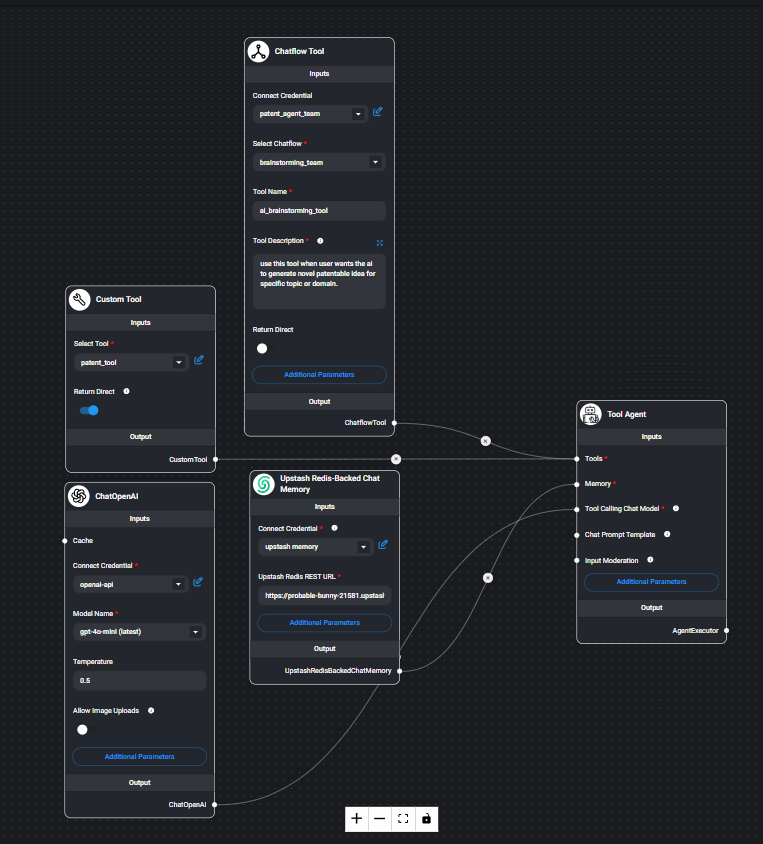
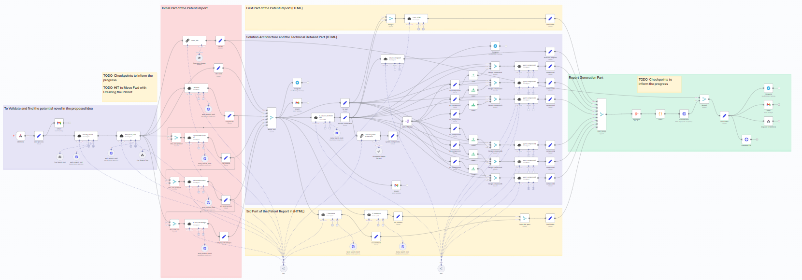

# Welcome to your Lovable project

## Project info

# IdeaSketch

IdeaSketch is a modern web application built with Next.js that provides an AI-powered chat interface to assist with developing patent ideas. The application features a responsive design, real-time message streaming, markdown rendering, and persistent chat history.


## Architecture Overview

IdeaSketch utilizes a sophisticated multi-service architecture for AI-powered patent idea generation:

### Overall Architecture


### Flowise Conversational Agent


### n8n Creat Patent doc tool



### Workflow Process

1. **Frontend Interface**: The Next.js application provides the user interface and handles communication with the AI backend.

2. **AI Agent (Flowise)**: The main AI agent is implemented as a Flowise flow, which:
   - Processes the initial user request
   - Orchestrates the patent creation workflow
   - Manages the conversation context and generation

3. **Patent Generation (n8n)**: The Flowise flow triggers an n8n workflow that:
   - Performs specialized patent-specific processing
   - Generates structured patent ideas and content
   - Returns processed results to the Flowise agent

4. **Response Stream**: The AI-generated responses are streamed back to the frontend in real-time, creating a seamless user experience.

This architecture allows for complex AI processing while maintaining a responsive user interface.

## Features

- **Responsive UI**: Works seamlessly on desktop and mobile devices
- **Real-time Message Streaming**: See AI responses as they're generated
- **Markdown Support**: Rich text formatting with code syntax highlighting
- **Persistent Chat History**: Saves your conversations locally
- **Dark Mode Support**: Automatically adapts to your system preferences
- **Multiple Chat Sessions**: Create and manage multiple conversations

## Tech Stack
- **BackEnd**: n8n workflow to create patent document
- **BackEnd**: Flowise workflow to create brainstorming Multi-AI Agents (LangGraph)
- **BackEnd**: Flowise Conversational AI Agent API that has Access to 2 Tools (brainstorming, create patent document)
- **Framework**: [Next.js 15](https://nextjs.org/)
- **UI**: [React 19](https://react.dev/)
- **Styling**: [Tailwind CSS 4](https://tailwindcss.com/)
- **Icons**: [React Feather](https://github.com/feathericons/react-feather)
- **Markdown**: [React Markdown](https://github.com/remarkjs/react-markdown)
- **Syntax Highlighting**: [React Syntax Highlighter](https://github.com/react-syntax-highlighter/react-syntax-highlighter)
- **Table Support**: [Remark GFM](https://github.com/remarkjs/remark-gfm)
- **Build Tool**: [Turbopack](https://turbo.build/pack)


**Use your preferred IDE**

If you want to work locally using your own IDE, you can clone this repo and push changes. Pushed changes will also be reflected in Lovable.

The only requirement is having Node.js & npm installed - [install with nvm](https://github.com/nvm-sh/nvm#installing-and-updating)

Follow these steps:

```sh
# Step 1: Clone the repository using the project's Git URL.
git clone <YOUR_GIT_URL>

# Step 2: Navigate to the project directory.
cd <YOUR_PROJECT_NAME>

# Step 3: Install the necessary dependencies.
npm i

# Step 4: Start the development server with auto-reloading and an instant preview.
npm run dev
```

**Edit a file directly in GitHub**

- Navigate to the desired file(s).
- Click the "Edit" button (pencil icon) at the top right of the file view.
- Make your changes and commit the changes.

**Use GitHub Codespaces**

- Navigate to the main page of your repository.
- Click on the "Code" button (green button) near the top right.
- Select the "Codespaces" tab.
- Click on "New codespace" to launch a new Codespace environment.
- Edit files directly within the Codespace and commit and push your changes once you're done.

## What technologies are used for this project?

This project is built with:
- n8n
- Flowise
- Vite
- TypeScript
- React
- shadcn-ui
- Tailwind CSS

